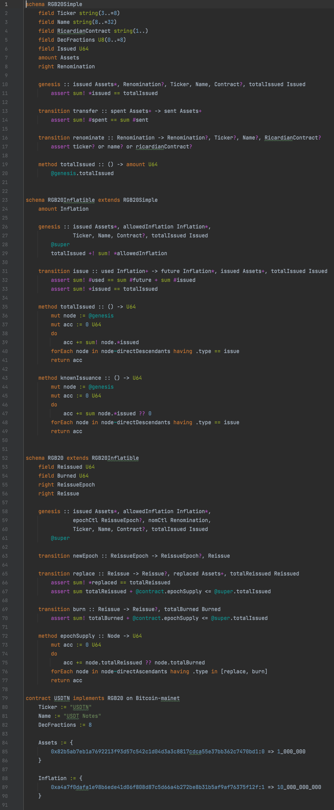

# Contractum: RGB smart contract language

Repository is a prototyping for possible RGB contract language, which should
compile to RGB Schema data with additional validation code running on virtual
machine(s) supported by RGB (currently this will be AluVM)

For a sample code pls check [RGB20 fungible token](attempt2/rgb20.con)
contract, which should compile into RGB20 Schema. You may also see how code 
compilation into [AluVM] assembly [may look like](attempt2/rgb20.aluasm)
and check [PEG] [grammar of contractum language](attempt2/grammar.pest).

Here is an example of highlighted Contractum code:

[AluVM]: https://www.aluvm.org
[PEG]: https://en.wikipedia.org/wiki/Parsing_expression_grammar 
